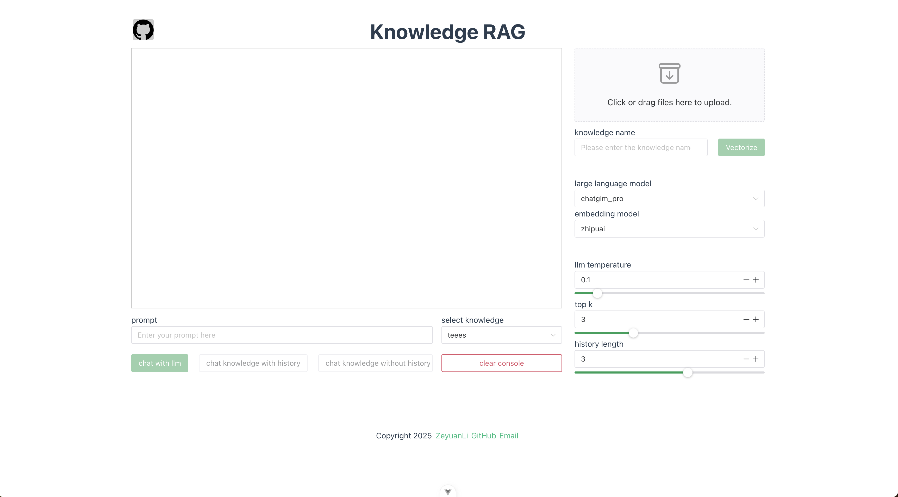
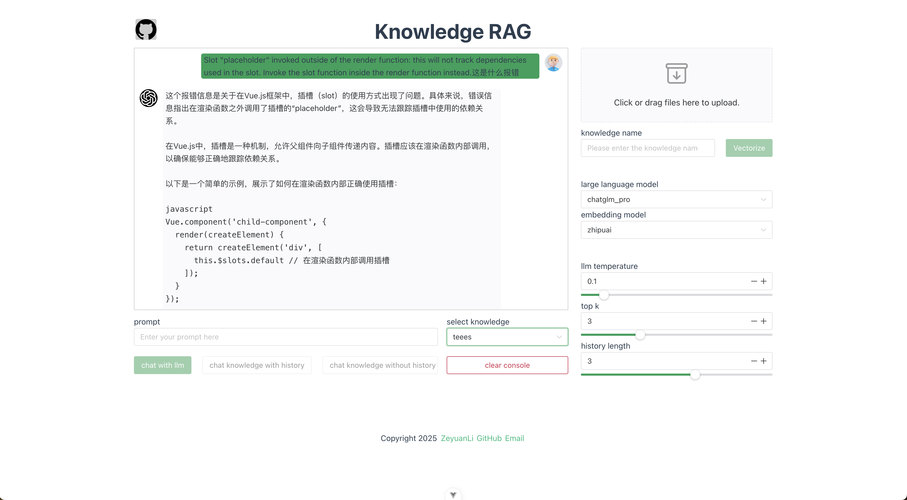

<p align="center">
    <a href="./README.zh-CN.md">简体中文</a> ｜ <a href="./README.md">English</a>
</p>

Inspired by [llm-universe](https://datawhalechina.github.io/llm-universe/#/), this project is a refactored version. A knowledge Q&A system based on Django+Vue that supports document upload, vector retrieval, and intelligent conversation, integrating multiple LLM models with historical conversation capabilities.

Although I don't like to define myself as a backend programmer, most of my work time is spent on backend development. I've always been very interested in the field of large model application development. After reading many related articles, I felt that my understanding of large models wasn't deep enough, so I decided to practice with this knowledge Q&A system. As the saying goes: "Practice makes perfect!"

## 1. Project Screenshots
   

## 2. Tech Stack
- Frontend: Vue + Naive UI
- Backend: Python + Django + LangChain
- Database: MySQL + Chroma + MinIO
- Deployment: Docker Compose orchestration

## 3. Core Features
- Support for multiple format document uploads, MinIO object storage, and document vectorization
- Direct conversation with large language models and knowledge base-based continuous dialogue
- Support for multiple large language model selection with adjustable parameters: temperature, top_k, history length
- Friendly chat interface with Markdown format display and one-click history clearing

## 4. How It Works


The process is roughly divided into three stages: indexing, retrieval, and generation. The RAG Q&A process includes the following operations:

1. User asks a question (Query)

2. Load and read knowledge base documents

3. Split the knowledge base documents

4. Vectorize the split knowledge base text and store it in the vector database to build an index

5. Vectorize the question (Query)

6. Match the top k most similar vectors to the Query vector in the knowledge base document vectors

7. Use the matched knowledge base text as context (Context) and add it to the prompt along with the question

8. Submit to LLM to generate the answer (Answer)

## 5. Code Structure

```
knowledge-rag/
├── backend/                        # Django backend service
│   ├── application/                # Django project configuration
│   │   ├── settings.py             # Project settings (database, middleware, app config)
│   │   ├── urls.py                 # Main routing configuration
│   │   └── wsgi.py                 # WSGI deployment configuration
│   ├── chats/                      # Chat conversation module
│   │   ├── models.py               # Chat record data models
│   │   ├── views.py                # Chat API views (pure LLM chat, knowledge base Q&A)
│   │   ├── serializers.py          # Data serializers
│   │   └── urls.py                 # Chat routing configuration
│   ├── files/                      # File management module
│   │   ├── models.py               # File data models
│   │   ├── views.py                # File upload and vectorization API
│   │   └── serializers.py          # File data serializers
│   ├── llm/                        # Large language model integration
│   │   ├── llm.py                  # LLM model calling interface
│   │   ├── zhipuai_llm.py          # ZhipuAI model wrapper
│   │   └── chat_qa_chain.py        # RAG Q&A chain implementation
│   ├── embedding/                  # Embedding models
│   │   └── zhipuai_embedding.py    # ZhipuAI embedding model
│   ├── plugins/                    # Third-party service plugins
│   │   ├── chroma.py               # Chroma vector database operations
│   │   └── minio.py                # MinIO object storage operations
│   ├── models/                     # General data models (deleted)
│   ├── knowledge_db/               # Knowledge base file storage
│   └── manage.py                   # Django management script
├── frontend/                       # Vue3 frontend application
│   ├── src/
│   │   ├── components/             # Vue components
│   │   │   ├── Chat.vue            # Chat interface component
│   │   │   ├── Files.vue           # File upload component
│   │   │   ├── LLMSelecter.vue     # Model selection component
│   │   │   └── LLMSetting.vue      # Model parameter settings component
│   │   ├── api/                    # API interface encapsulation
│   │   │   └── index.ts            # Frontend API calls
│   │   └── App.vue                 # Main application component
│   ├── package.json                # Frontend dependency configuration
│   └── vite.config.js              # Vite build configuration
├── docker-compose.yaml             # Docker container orchestration configuration
├── requirements.txt                # Python dependencies
└── README.md                       # Project documentation
```

## 6. Getting Started

#### 1. Install Dependencies
- Docker
  ```
  brew install docker
  brew install docker-compose
  ```

- pyenv, Python 3.10.0+:
  ```
  brew install pyenv
  brew install pyenv-virtualenv
  
  pyenv install 3.10.0
  pyenv virtualenv 3.10.0 venv-3.10.0
  pyenv activate venv-3.10.0
  ```

- [Install Node 22.12.0+](https://nodejs.org/en/download)

#### 2. Start Services
- Start MySQL, MinIO
  ```
  cd knowledge-rag/
  docker-compose up -d
  ```

- Start Backend
  ```
  cd knowledge-rag/backend
  pip install -r requirements.txt # Install dependencies
  python manage.py makemigrations # Generate migration files
  python manage.py migrate # Migrate to database
  python manage.py runserver 19001
  ```

- Start Frontend
  ```
  cd ../frontend
  npm install # Install dependencies
  npm run dev
  ```

## 7. Acknowledgments
- https://github.com/datawhalechina/llm-universe?tab=readme-ov-file
- https://github.com/logan-zou/Chat_with_Datawhale_langchain
