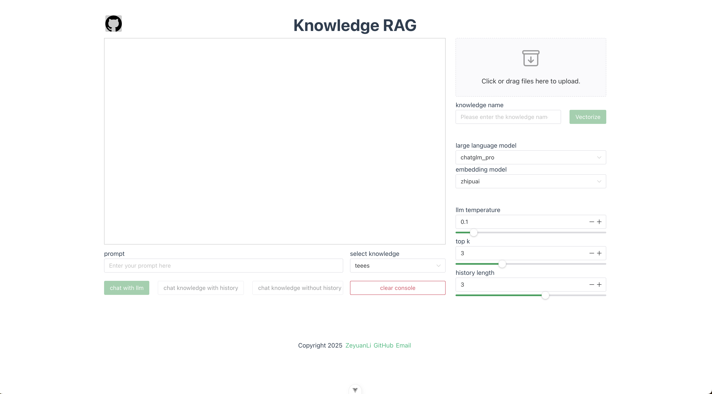
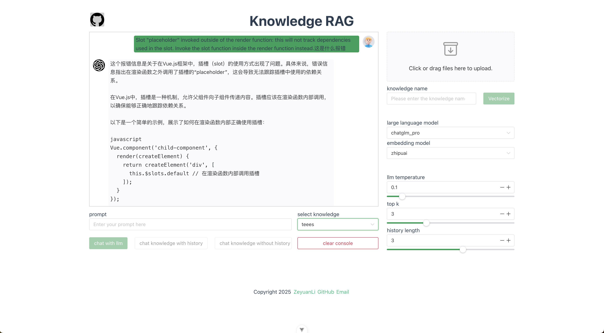

<p align="center">
    <a href="./README.zh-CN.md">简体中文</a> ｜ <a href="./README.md">English</a>
</p>

灵感来源于[llm-universe](https://datawhalechina.github.io/llm-universe/#/)，在此基础上做了重构。基于Django+Vue的知识问答系统，支持文档上传、向量检索和智能对话，集成多种LLM模型，提供带历史记录的知识问答功能。

我并不愿意把自己定义成后端程序员，虽然平时工作绝大部分时间都在处理后端开发工作。一直对大模型应用开发领域非常感兴趣，阅读了一些相关的文章，但是总感觉对大模型理解不够深入，所以动手实践了这个知识问答系统。正所谓：实践出真知！

## 一、项目截图
   

## 二、技术栈
- 前端：Vue + Naive UI
- 后端：Python + Django + LangChain
- 数据库：Mysql + Chroma + MinIO
- 部署：docker compose编排

## 三、核心功能
- 支持多种格式文档上传，基于MinIO的对象存储，文档向量化处理
- 直接与大语言模型对话，基于知识库的连续对话
- 支持多种大语言模型选择，可调节模型参数：temperature、top_k、历史长度
- 友好聊天界面，Markdown格式展示，一键清空历史

## 四、工作原理


大致分为索引，检索和生成三个阶段,RAG 问答过程包括如下操作：

1.用户提出问题 Query

2.加载和读取知识库文档  

3.对知识库文档进行分割  

4.对分割后的知识库文本向量化并存入向量库建立索引 

5.对问句 Query 向量化  

6.在知识库文档向量中匹配出与问句 Query 向量最相似的 top k 个

7.匹配出的知识库文本文本作为上下文 Context 和问题⼀起添加到 prompt 中   

8.提交给 LLM 生成回答 Answer

## 五、代码结构

```
knowledge-rag/
├── backend/                        # Django后端服务
│   ├── application/                # Django项目配置
│   │   ├── settings.py             # 项目设置（数据库、中间件、应用配置）
│   │   ├── urls.py                 # 主路由配置
│   │   └── wsgi.py                 # WSGI部署配置
│   ├── chats/                      # 聊天对话模块
│   │   ├── models.py               # 聊天记录数据模型
│   │   ├── views.py                # 聊天API视图（纯LLM对话、知识库问答）
│   │   ├── serializers.py          # 数据序列化器
│   │   └── urls.py                 # 聊天路由配置
│   ├── files/                      # 文件管理模块
│   │   ├── models.py               # 文件数据模型
│   │   ├── views.py                # 文件上传、向量化API
│   │   └── serializers.py          # 文件数据序列化器
│   ├── llm/                        # 大语言模型集成
│   │   ├── llm.py                  # LLM模型调用接口
│   │   ├── zhipuai_llm.py          # 智谱AI模型封装
│   │   └── chat_qa_chain.py        # RAG问答链实现
│   ├── embedding/                  # 嵌入模型
│   │   └── zhipuai_embedding.py    # 智谱AI嵌入模型
│   ├── plugins/                    # 第三方服务插件
│   │   ├── chroma.py               # Chroma向量数据库操作
│   │   └── minio.py                # MinIO对象存储操作
│   ├── models/                     # 通用数据模型（已删除）
│   ├── knowledge_db/               # 知识库文件存储
│   └── manage.py                   # Django管理脚本
├── frontend/                       # Vue3前端应用
│   ├── src/
│   │   ├── components/             # Vue组件
│   │   │   ├── Chat.vue            # 聊天界面组件
│   │   │   ├── Files.vue           # 文件上传组件
│   │   │   ├── LLMSelecter.vue     # 模型选择组件
│   │   │   └── LLMSetting.vue      # 模型参数设置组件
│   │   ├── api/                    # API接口封装
│   │   │   └── index.ts            # 前端API调用
│   │   └── App.vue                 # 主应用组件
│   ├── package.json                # 前端依赖配置
│   └── vite.config.js              # Vite构建配置
├── docker-compose.yaml             # Docker容器编排配置
├── requirements.txt                # Python依赖包
└── README.md                       # 项目说明文档
```

## 六、启动项目
#### 1、安装依赖
- docker
  ```
  brew install docker
  brew install docker-compose
  ```

- pyenv、python 3.10.0+：
  ```
  brew install pyenv
  brew install  pyenv-virtualenv
  
  pyenv install 3.10.0
  pyenv virtualenv 3.10.0 venv-3.10.0
  pyenv activate venv-3.10.0
  ```

- [install node 22.12.0 +](https://nodejs.org/en/download)

#### 2、启动服务
- 启动Mysql、MinIO
  ```
  cd knowledge-rag/
  docker-compose up -d
  ```

- 启动后端
  ```
  cd knowledge-rag/backend
  pip install -r requirements.txt # 安装依赖
  python manage.py makemigrations # 生成迁移文件
  python manage.py migrate # 迁移到数据库
  python manage.py runserver 19001
  ```

- 启动前端
  ```
  cd ../frontend
  npm install # 安装依赖
  npm run dev
  ```

## 七、致谢
- https://github.com/datawhalechina/llm-universe?tab=readme-ov-file
- https://github.com/logan-zou/Chat_with_Datawhale_langchain